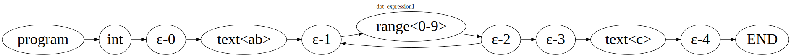

## Readme

The idea of this project is being a BNF expression compiler.

We could use BNF to design some syntax like Arithmetic expression

```
<factor> ::= <int> | "(" <expr> ")"
<int> ::= [0-9]+
<term> ::= <factor> (("*" | "/" ) <factor>)*
<expr> ::= <term> (("+" | "-") <term>)*
```

It matches any simple arithmetic expression such as

```
68/(8*((34+3+89)))
9*(94*57)/9*30-5*9-48+(557)
```

However, You have to write your own interpreter.

So I was thinking, It probably an interesting thing to write a compiler for the BNF expression and that's it.

Here is the syntax list for BNF

```
<text> ::= ([a-z] | [0-9] | "*" | "/" | "+" | "-" | "(" | ")")+
<quantifier> ::= "?" | "+" | "*"
<exp_name> ::= "<" <text> ">"
<var> ::= "\"" <text> "\""
<var_group> ::= "[" <text> "-" <text> "]"
<factor> ::= <var> | <exp_name> | <var_group> | "(" <exp_list> ")"
<exp> ::= <factor> <quantifier>?
<exp_list> ::= <exp> "|"? <exp_list> | <exp>
<declaration> ::= <exp_name> "::=" <exp_list>
<program> ::= <declaration> <program> | <declaration>
```

I turn the syntax to an AST (abstract syntax tree) and then convert the AST to NFA.

So we could allow you to design your syntax.

Here is the testcase for arithmetic expression

```
@Test
fun testNFASearch() {
    val text = """
    <int> ::= [0-9]+
    <factor> ::= <int> | "(" <expr> ")"
    <term> ::= <factor> (("*" | "/" ) <factor>)*
    <expr> ::= <term> (("+" | "-") <term>)*
    """.trimIndent()
    //Initial the NFA symbol table.
    val symbolTableNodeVisitor = SymbolTableNodeVisitor(ExpressionParser(Lexer(text)))
    symbolTableNodeVisitor.visitNode()
    val symbolTable = symbolTableNodeVisitor.getSymbolTable()

    val nodeVisitor = NFANodeVisitor(symbolTable, ExpressionParser(Lexer(text)))
    val programNode = nodeVisitor.visitNode()
    val subProgram = programNode.getSubProgram("expr")
    val matcher = NFAEngine(subProgram)
    val str =
        "(((1+660)/8313)-((((5*(4*6))/6)-27/25981/9)+6*5-7)*(((26)/2-5+(5414-267)))/((648))/((4)/46)-71)*0+(925)/(66)"
    val pathList = matcher.search(str)
    for (path in pathList) {
        val subStr = str.substring(path.start, path.end)
        println(subStr + " Matcher:" + path.state.matcher)
    }
    val path = pathList.last()
    Assertions.assertEquals(path.end, str.length)
}
```

We can use this engine to track or match any text by using your syntax.

Here are some pictures that I was turn the AST to NFA


### Test cases

* [ExpressionLexerTest](src/test/kotlin/cz/bnf/playground/ExpressionLexerTest.kt)
* [ExpressionParserTest](src/test/kotlin/cz/bnf/playground/ExpressionParserTest.kt)
* [NFADotGeneratorTest](src/test/kotlin/cz/bnf/playground/nfa/NFADotGeneratorTest.kt)
* [NFAEngineTest](src/test/kotlin/cz/bnf/playground/nfa/NFAEngineTest.kt)
* [NFAGraphMatcherTest](src/test/kotlin/cz/bnf/playground/nfa/NFAGraphMatcherTest.kt)
* [NFANodeVisitorTest](src/test/kotlin/cz/bnf/playground/nfa/NFANodeVisitorTest.kt)
* [SymbolTableNodeVisitorTest](src/test/kotlin/cz/bnf/playground/nfa/SymbolTableNodeVisitorTest.kt)

### How I design the quantifiers

* For symbol '+'

```
[0-9]+
```



* For symbol '*'

```
[0-9]*
```


* For symbol '?'

```
[0-9]?
```


### References

* [bnf-playground](https://bnfplayground.pauliankline.com/)
* [GraphvizOnline](https://dreampuf.github.io/GraphvizOnline/)
